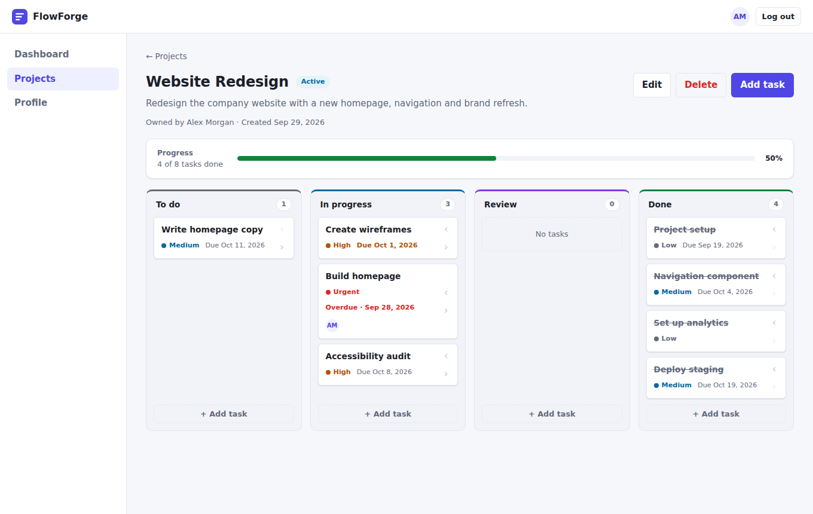
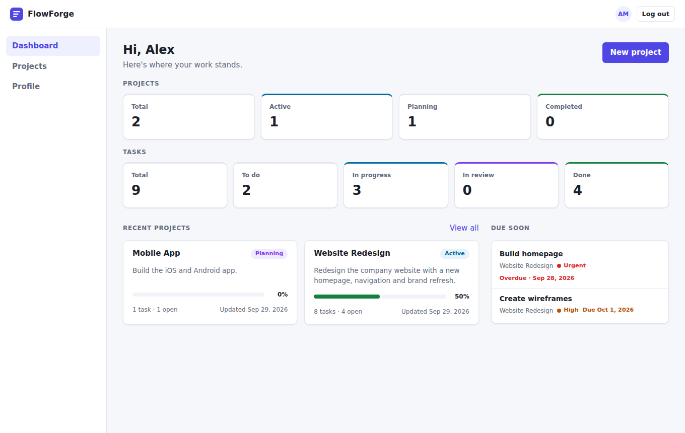

# FlowForge

FlowForge is a full-stack project and task manager. Users sign up, create projects, add tasks with priorities and due dates, and move them across a Kanban board (To do → In progress → Review → Done) while the project's progress updates.



**Live demo:** https://flowforge-89tc.vercel.app
_(Hosted on a free plan, so the first load after inactivity can take about a minute.)_

## Features (MVP)

- Registration and login with BCrypt-hashed passwords and JWT authentication
- Projects: create, view, edit, delete, filter by status, search by name or description
- Tasks: create, edit, delete, priority, due date, assign to yourself
- Kanban board: move tasks with the arrow buttons or drag and drop
- Progress: the percentage of a project's tasks that are Done
- Dashboard: project and task counts, recent projects, and open tasks due in the next 7 days (including overdue ones)
- Authorization: a user can only see and change their own projects and tasks
- Validation, consistent JSON error responses, and Flyway database migrations
- Responsive layout with light and dark themes



## Tech stack

| Layer | Tech |
|---|---|
| Frontend | React 19, Vite 6, React Router 6, plain CSS |
| Backend | Java 21, Spring Boot 3.5 (Web, Data JPA, Validation, Security), JJWT 0.12 |
| Database | PostgreSQL 16, Flyway migrations |
| Tests | JUnit 5 + MockMvc on H2 (backend), Vitest (frontend) |

## Architecture

```
React (Vite, :5173)
   │  fetch + "Authorization: Bearer <jwt>"
   ▼
Spring Boot (:8080)
   Controller  →  Service  →  Repository  →  PostgreSQL (:5432)
                    │
          ProjectAccessService (all "who may do what" checks)
```

```
backend/src/main/java/com/flowforge/backend/
├── controller/   HTTP routing only
├── service/      business logic, transactions, access checks
├── repository/   Spring Data JPA interfaces
├── model/        JPA entities and enums
├── dto/          request/response records (entities are never serialized)
├── security/     JwtService, JwtAuthFilter, AuthUser principal
├── config/       SecurityConfig (CORS, stateless JWT), AppProperties
└── exception/    API exceptions and the global @RestControllerAdvice handler

frontend/src/
├── services/     api.js (single fetch wrapper) + auth/project/task services
├── context/      AuthContext (token, current user, login/logout)
├── hooks/        useAsync (loading / error / reload)
├── components/   Layout, TaskBoard, ProjectCard, forms, modal, badges…
├── pages/        Login, Register, Dashboard, Projects, ProjectDetails, Profile
└── utils/        enum labels, date helpers
```

### Design decisions

- **Access rules live in one class.** `ProjectAccessService` decides who can read or edit a project. Today that's the owner only. Adding `ProjectMember` roles later means changing that class, not every controller.
- **Other users' resources return 404, not 403.** This keeps project and task IDs from being discovered by probing.
- **Flyway owns the schema.** `V1__init.sql` creates the tables, and Hibernate runs with `ddl-auto=validate`, so it checks the schema but never changes it. To change the schema, add `V2__….sql`.
- **Task counts use one grouped query** per page instead of loading every task.
- **Progress** is `round(done / total × 100)`, and 0 for a project with no tasks.
- **Logout** happens on the client: the token is discarded. Tokens expire after `JWT_EXPIRATION_MINUTES` (default 24h).

## Running locally

### Prerequisites

- Java 21, Maven 3.9+
- Node 20+
- PostgreSQL 16, either installed locally or via Docker

### 1. Database

With Docker:

```bash
docker compose up -d
```

Or with a local PostgreSQL:

```sql
CREATE USER flowforge WITH PASSWORD 'flowforge';
CREATE DATABASE flowforge OWNER flowforge;
```

### 2. Backend

```bash
cd backend
mvn spring-boot:run
```

Flyway creates the tables on first start. Check that it's up:

```bash
curl http://localhost:8080/api/hello
# FlowForge backend is running!
```

To run the tests, which use in-memory H2 and need no database:

```bash
mvn test
```

To add the Maven wrapper (`./mvnw`) to the repo, run `mvn -N wrapper:wrapper` once and commit the generated files.

### 3. Frontend

```bash
cd frontend
npm install
npm run dev
```

Then open http://localhost:5173, register an account, and create a project.

## Environment variables

Backend (see `backend/.env.example`). The defaults work for local development only:

| Variable | Default (dev) | Purpose |
|---|---|---|
| `DB_URL` | `jdbc:postgresql://localhost:5432/flowforge` | JDBC URL |
| `DB_USERNAME` / `DB_PASSWORD` | `flowforge` / `flowforge` | DB credentials |
| `JWT_SECRET` | dev placeholder | HMAC key, **at least 32 characters** |
| `JWT_EXPIRATION_MINUTES` | `1440` | Token lifetime |
| `CORS_ALLOWED_ORIGINS` | `http://localhost:5173` | Comma-separated exact origins |
| `PORT` | `8080` | HTTP port |

With `SPRING_PROFILES_ACTIVE=prod`, none of these have defaults and the app refuses to start without them.

Frontend (see `frontend/.env.example`):

| Variable | Default | Purpose |
|---|---|---|
| `VITE_API_URL` | `http://localhost:8080` | Backend base URL |

## API overview

Every endpoint except the auth and health routes needs `Authorization: Bearer <token>`.

| Method | Path | Description |
|---|---|---|
| GET | `/api/hello` | Health check (public) |
| POST | `/api/auth/register` | `{name, email, password}` → `{token, expiresInSeconds, user}` |
| POST | `/api/auth/login` | `{email, password}` → `{token, expiresInSeconds, user}` |
| GET | `/api/users/me` | Current user |
| GET | `/api/dashboard` | Counts, recent projects, tasks due soon |
| GET | `/api/projects?status=&q=` | List own projects (filter/search optional) |
| POST | `/api/projects` | `{name, description?, status?}` (status defaults to `PLANNING`) |
| GET | `/api/projects/{id}` | Project with `taskCounts`, `totalTasks`, `progress` |
| PUT | `/api/projects/{id}` | Update name/description/status |
| DELETE | `/api/projects/{id}` | Delete project and its tasks |
| GET | `/api/projects/{id}/tasks?status=&priority=&sort=dueDate\|priority` | List tasks |
| POST | `/api/projects/{id}/tasks` | `{title, description?, status?, priority?, dueDate?, assignedUserId?}` |
| GET | `/api/tasks/{id}` | One task |
| PUT | `/api/tasks/{id}` | Replace task fields |
| PATCH | `/api/tasks/{id}/status` | `{status}` |
| DELETE | `/api/tasks/{id}` | Delete task |

Enums: project status `PLANNING | ACTIVE | ON_HOLD | COMPLETED | ARCHIVED`; task status `TODO | IN_PROGRESS | REVIEW | DONE`; priority `LOW | MEDIUM | HIGH | URGENT`. Dates are `yyyy-MM-dd`.

Errors always look like this:

```json
{ "status": 400, "message": "Project name cannot be empty", "timestamp": "2026-09-29T16:00:00",
  "fieldErrors": { "name": "Project name cannot be empty" } }
```

## Deployment

- **Frontend** goes to Vercel or Netlify. Set `VITE_API_URL` to the backend's HTTPS URL. Because it's a single-page app, add a rewrite of all paths to `/index.html`.
- **Backend** goes to Render, Railway or Fly.io. Build with `mvn -DskipTests package`, run `java -jar target/backend-0.1.0.jar`, and set `SPRING_PROFILES_ACTIVE=prod` plus the variables above. Set `CORS_ALLOWED_ORIGINS` to the frontend's exact URL.
- **Database**: any managed PostgreSQL. Flyway migrates it on startup.

## Security notes

- The JWT is kept in `localStorage`. That's simple, but any XSS bug on the site could read it. For higher assurance, move to an httpOnly cookie plus CSRF protection.
- There's no rate limiting on `/api/auth/login` yet. Add it before a public launch.

## Roadmap

In rough order of value:

1. Project members and roles (`project_members`). Change `ProjectAccessService` to grant access by role, then let tasks be assigned to members.
2. Custom workflows (`workflows`, `workflow_statuses`). This replaces the `TaskStatus` enum with a foreign key.
3. Task comments and an activity log
4. Pagination (`Pageable`) on list endpoints
5. Notifications for assignments and approaching due dates
6. Docker image, CI (GitHub Actions running `mvn test` and `npm test`), and production deployment
